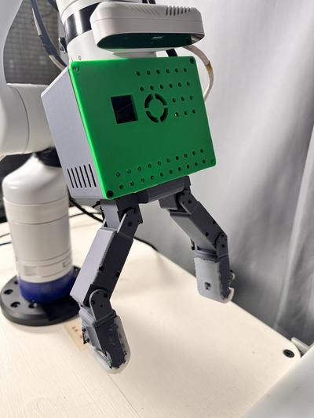

# Sensorized Hand

## About 
This repository contains the control code for a custom, fully-actuated sensorized hand. It is designed to be implemented on a Raspberry Pi with ROS 2, which requires Ubuntu 22.04. 



## Installation
Create a ROS 2 workspace. Within the source directory clone this repo:
```console
git clone --recurse-submodules git@github.com:OSUrobotics/sensorized_hand.git
```
Install the required dependencies:
```console
python3 -m pip install dynamixel-control
```
Build the workspace by running colcon build from the /src folder:
```console
colcon build --symlink-install
. install/setup.bash
```
Don't forget to add sourcing both the workspace and ROS install to the .bashrc!

## Usage
To launch everything, run:
```console
ros2 launch fingers all_launch.py
```
To launch only the IMUs, TOFs, or motors:
```console
ros2 launch imu bringup_imus_launch.py 
```
```console
ros2 launch tof tof_bringup_launch.py 
```
```console
ros2 run fingers motor_control.py 
```

## Other notes
You may need to downgrade setup tools:
```console
pip install setuptools==58.2.0
```

colcon build --event-handlers console_direct+ --cmake-args -DCMAKE_VERBOSE_MAKEFILE=ON

source /opt/ros/humble/setup.bash
. install/setup.bash


ros2 run tof talker 

colcon build --packages-select tof

ros2 interface show hand_msgs/msg/Tofzone
colcon build --symlink-install

colcon clean workspace

i2cdetect -y 1
7 bit to 8 bit i2c representation....

ros2 interface show 

rosdep install --from-paths src -y --ignore-src
colcon build --symlink-install

rate.sleep is blocking in motor implementation - temporarily just using time sleep (search for a better implementation?) May also not be an issue as before ros spin

# Todo
Possibly timestamp/header all of my custom msg types?


<!-- vcgencmd get_throttled -->
vcgencmd measure_temp